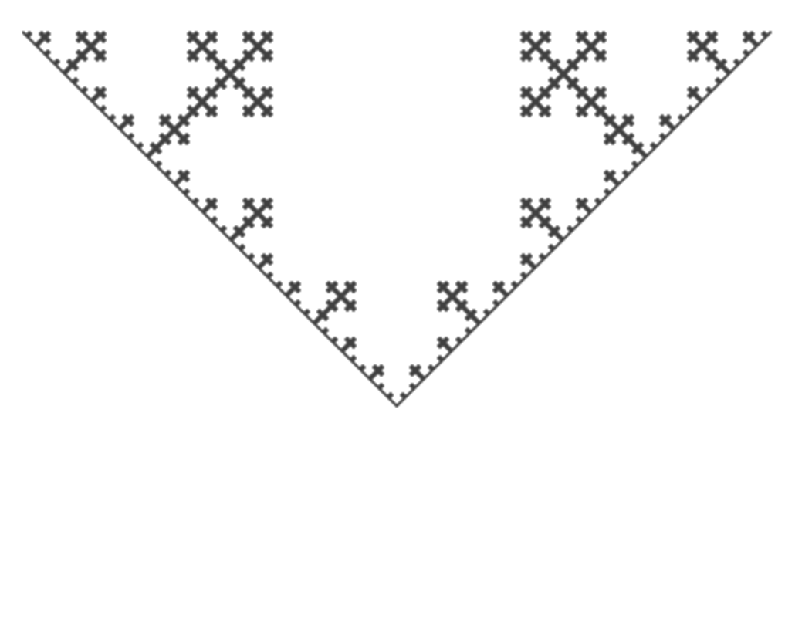

# Lindenmayer system demo in ReasonML

Demo for parsing [L-system](https://en.wikipedia.org/wiki/L-system) strings and drawing on a canvas in [ReasonML](https://facebook.github.io/reason/).

Ongoing experiments with canvas and L-systems for ReasonML.

## Koch curve example

```reason
let gens = 5;
let r1 = {
  let rules = [
    ('F', "F+F-F-F+F"),
  ];
  let start = "F";
  let constants = ['[', ']', '+', '-'];
  Lsystem.create start gens rules constants;
};

let ctxt = Canvas.createAndGet (600, 400);
let len = weighted_length 65.0 gens;
let start_point = (0.0, 20.0);
let angle = 90;
Draw.lsystem ctxt start_point len angle r1;
```

Outputs:

